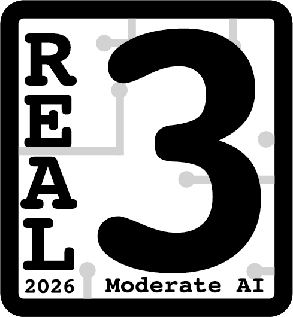

# uMotd

*uMotd is the translatable MOTD for Universal Blue!*

⚠️ **WIP** : Some features still need testing and strings need to be checked. ⚠️

**Contributions are welcome!** If you want to contribute, you're welcome to submit a pull request or [open an issue](https://github.com/projectbluefin/umotd/issues) - it's very much appreciated ❤️

Want to configure or contribute to uMotd ? Take a look at the [documentation](https://github.com/projectbluefin/umotd/tree/main/docs) !

> Interessed in the configurable CLI Banner instead ? Check [uwelcome](https://github.com/projectbluefin/uwelcome/)

## How to try

<!-- ### Universal Blue system images

If you're running Bluefin Testing, it's already included in the image itself ! -->

### Download it from the releases page

You can download the binaries from the [releases page](https://github.com/projectbluefin/umotd/releases).

You can then rename it to `umotd` and place it in your usual `/bin` folder.

> Note: You won't receive automatic updates, you will have to download Umotd at each new release.

### Compile from source

You'll need to have [`go`](https://repology.org/project/go/versions) installed on your system to compile uMotd from source.

Then you'll have to simply clone the repository and then build the binary:

```sh
git clone https://github.com/projectbluefin/umotd
cd umotd
go build
./umotd
```

You'll then have the `umotd` binary in the current directory, which you can just drop into your usual `/bin` folder and it will work without any further setup (except for the configuration file if you want to customize it).

## Commands

uMotd supports the following subcommands:

```sh
config-path # Prints the path of the config file

tags add <tag>...    # For adding tags
tags remove <tag>... # For removing tags
tags list            # For listing all of your tags

version # Prints the version of uMotd currently in use
```

Learn more in the [docs folder](https://github.com/projectbluefin/umotd/tree/main/docs) !

## AI usage

This project had mild AI involvement mainly for auto-completion and code checking.

[](https://www.realgoodai.org/real-rating)
